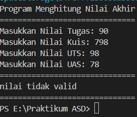
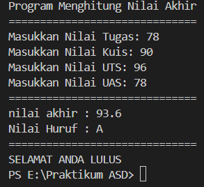
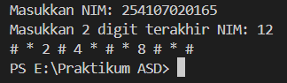
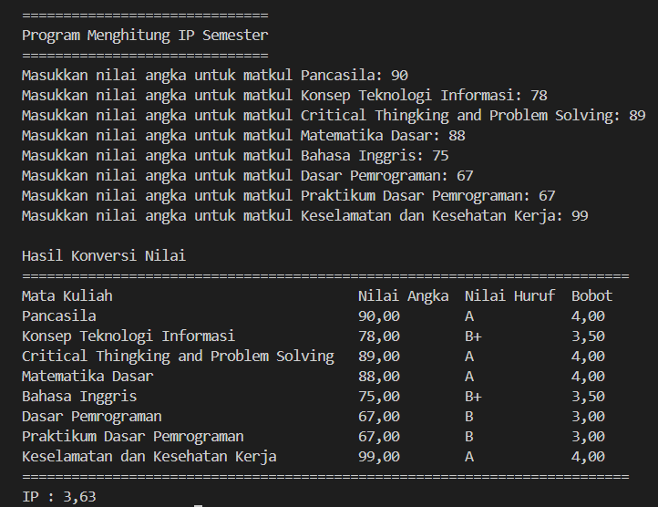
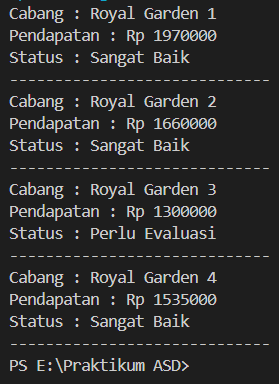
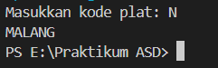
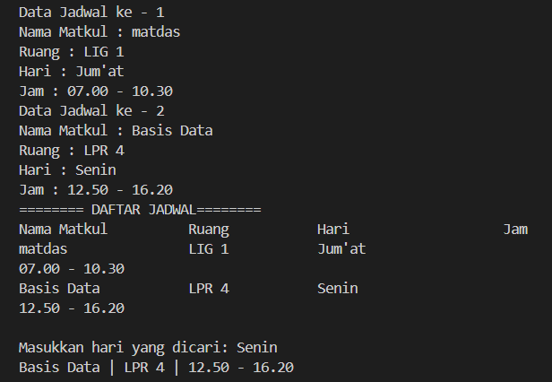

|  | Algorithm and Data Structure |
|--|--|
| NIM | 254107020165 |
| Nama |  Inas Asami El Murtadho |
| Kelas | TI - 1F |
| Repository | [link] (https://github.com/inasaeel-dev/PRAKTIKUM-ASD-2026/tree/main) |

## 1.1 Praktikum Pemilihan

Hasil jika memasukkan nilai tidak valid:

Hasil jika memasukkan nilai valid:

## 1.2 Praktikum Perulangan

Hasil perulangan dengan 2 digit terakhir NIM: 

## 1.3 Praktikum Array

Hasil praktikum menghitung IP Semester:

## 1.4 Praktikum Fungsi

Hasil fungsi royal garden:

## 2.0 Tugas 1 Minggu Pertama

Hasil nama kota dari kode plat:

## 2.1 Tugas 2 Minggu Pertama

