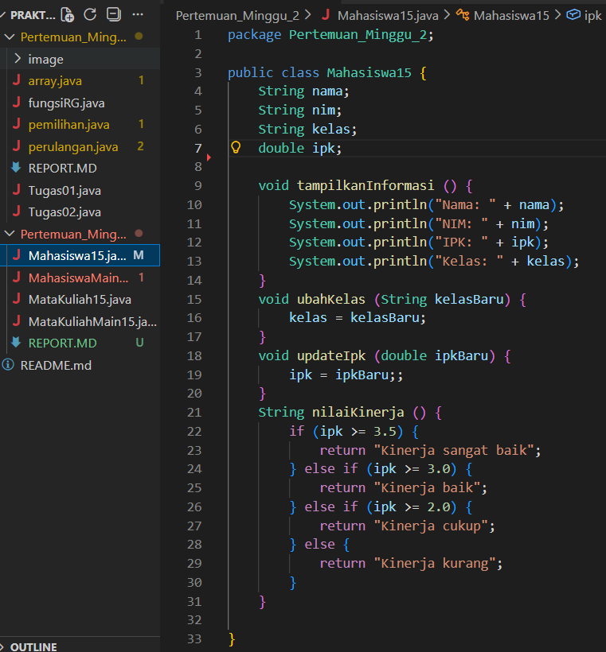
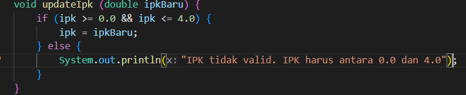
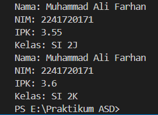
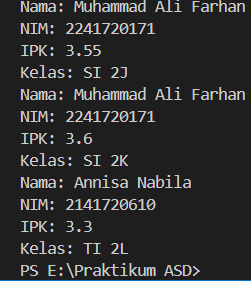
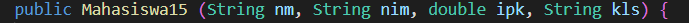
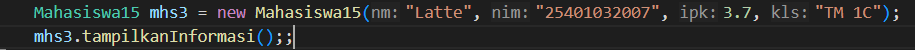
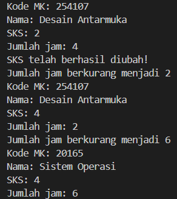
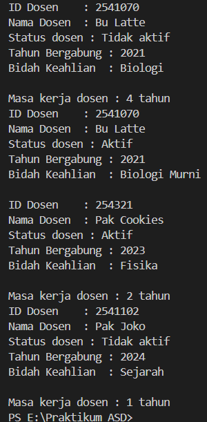

|  | Algorithm and Data Structure |
|--|--|
| NIM | 254107020165 |
| Nama |  Inas Asami El Murtadho |
| Kelas | TI - 1F |
| Repository | [link] (https://github.com/inasaeel-dev/PRAKTIKUM-ASD-2026/tree/main) |

## 1.1 Percobaan 1

## 1.2 Pertanyaan
1. Sebutkan dua karakteristik class atau object!
    > classs memiliki karakteristik atribut dna method atau fungsi
2. Perhatikan class mahasiswa pada praktikum 1 tersebut, ada berapa atribut yang dimiliki oleh class
mahasiswa? sebutkan apa saja atributnya!
    > nama, nim, kelas dan ipk
3. Ada berapa method yang dimiliki oleh class tersebut? sebutkan apa saja methodnya!
    > tampilkanInformasi(), ubahKelas (), updateIPK(), dan nilaiKinerja()
4. Perhatikan method updateIPK() yang terdapat di dalam class mahasiswa. Modifikasi isi method tersebut sehingga IPK yang dimasukkan valid yaitu terlebih dahulu dilakukan pengecekan apakah IPK yang dimasukkan di dalam rentang 0.0 sampai dengan 4.0 (0.0 <= IPK <= 4.0). Jika IPK tidak pada rentang tersebut maka dikeluarkan pesan: "IPK tidak valid. Harus antara 0.0 dan 4.0"
    > 

5. Jelaskan bagaimana cara kerja method nilaiKinerja() dalam mengevaluasi kinerja mahasiswa, kriteria apa saja yang digunakan untuk menentukan nilai kinerja tersebut, dan apa yang dikembalikan (di-return-kan) oleh method nilaiKinerja() tersebut?
    > nilaiKinerja() cek kondisi jika nilai IPK (>= 3.5) maka kinerja sangat baik, 3.0 kinerja baik, 2.0 kinerja cukup, dan jika IPK dibawah 2.0 kinerja kurang. hasil dari kondisi tsb akan dikembalikan untuk di tampilkan ketika method dipanggil

## 2.1 Percobaan 2

## 2.2 Pertanyaan 
1. Pada class MahasiswaMain, tunjukkan baris kode program yang digunakan untuk proses instansiasi! Apa nama object yang dihasilkan?
    > 
2. Bagaimana cara mengakses atribut dan method dari suatu object?
    > Atribut diakses dengan cara namaObject.namaAtribut = nilai dan untuk mengakses method namaObject.namaMethod()
3. Mengapa hasil output pemanggilan menthod tampilkanInformasi() pertama dan kedua berbeda?
    > Karena pemanggilan method yg kedua sudah dilakukan perubahan nilai atribut object, sehingga output yg dihasilkan berbeda

## 3.1 Percobaan 3

## 3.2 Pertanyaan
1. Pada class mahasiswa di percobaan 3, tunjukkan baris kode program yg digunakan untuk mendeklarasikan konstruktor berparameter! 
    > 
2. Perhatikan class MahasiswaMain. apa sebenernya yg dilakukan pada baris program tsb?
    > Baris program tsb melakukan instansisasi pada konstruktor berparameter
3. Hapus konstruktor default pada class Mahasiswa, kemudian compile dan run program. bagaimana hasilnya? jelaskan mengapa hasilnya demikian?
    > Program tidak dapat dijalankan karena object dibuat tanpa ada parameter, sementara konstruktor tidak ada di class, sehingga pemanggilan tidak dapat menemukan konstruktor yg cocok
4. Setelah melakukan instansiasi object, apakah method di dalam class Mahasiswa harus diakses secara berurutan? Jelaskan alasannya!
    > Tidak, karena pemanggilan sesuai dengan kebutuhan
5. Buat object baru dengan nama mhs menggunakan konstruktor berparameter dari class Mahasiswa!
    > 

## 4.1 Latihan Praktikum
Hasil latihan praktikum 1
> 

Hasil latihan praktikum 2
> 