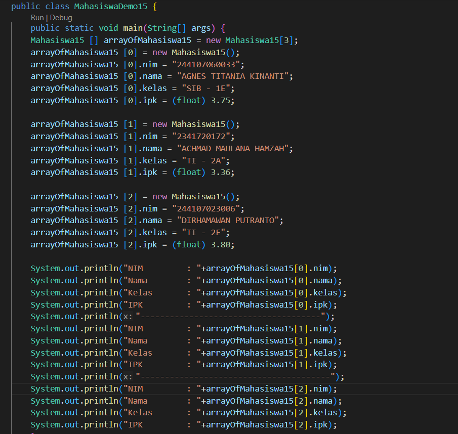
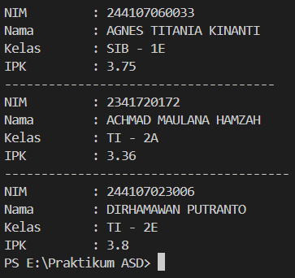
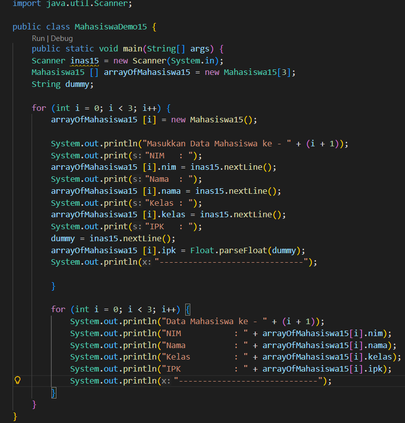
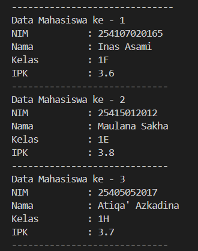
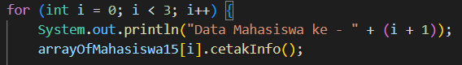
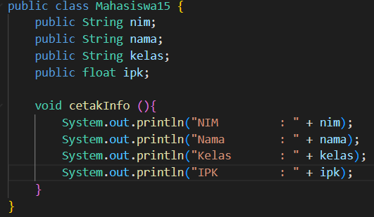
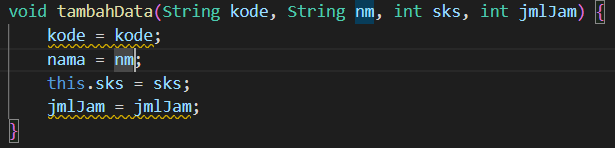
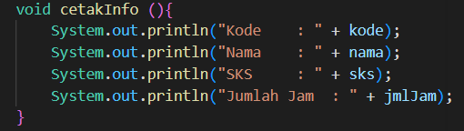
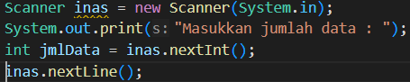

|  | Algorithm and Data Structure |
|--|--|
| NIM | 254107020165 |
| Nama |  Inas Asami El Murtadho |
| Kelas | TI - 1F |
| Repository | [link] (https://github.com/inasaeel-dev/PRAKTIKUM-ASD-2026/tree/main) |

## 3.2.1 Percobaan 1

## 3.2.2 Verifikasi Hasil Percobaan 1

## 3.2.3 Pertanyaan
1. Berdasarkan uji coba 3.2, apakah class yang akan dibuat array of object harus selalu memiliki atribut dan sekaligus method Jelaskan!
- tidak, karena class bisa berisi atribut maupun method saja

2. Apa yang dilakukan oleh kode program berikut?
- membuat arrayMahasiswa yang bisa menampung 3 objek mahasiswa

3. Apakah class mahasiswa memliki constructor? jika tidak kenapa bisa dilakukan pemanggilan constructor pada baris program berikut?
- tidak tetapi tetap bisa dilakukan pemanggilan constructor karena java otomatis menyediakan constructor default

4. Apa yang dilakukan oleh kode program tsb>
- membuat object mahasiswa baru dan mengisi atribut nama mahasiswa

5. Mengapa class mahasiswa dan mahasiswaDemo dipisahkan pada uji coba 3.2?
- class mahasiswaDemo fokus kepada logika eksekusi agar mudah mengelola data, sedangkan class mahasiswa untuk mendefinisikan object mahasiswa

## 3.3.1 Percobaan 2

## 3.3.1 Verifikasi Percobaan 2

## 3.3.1 Pertanyaan
1. Tambahkan method cetakInfo() pada class Mahasiswa kemudian modifikasi kode program pada langkah no 3.

2. Misalkan Anda punya array baru bertipe array of Mahasiswa dengan nama myArrayOfMahasiswa. Mengapa kode berikut menyebabkan error?
- myArrayOfMahasiswa hanya membuat slot sebanyak 3x namun variabel nya belum di inisialisasi sehingga isi dari array masih null

## 3.4.1 Percobaan 3

## 3.4.2 Pertanyaan
1. Apakah suatu class dapat memiliki lebih dari 1 constructor? Jika iya, berikan contohnya
- bisa, contohnya di file MataKuliah15 yg memiliki constructor ber parameter kode, nama, sks dan jumlah jam

2.  Tambahkan method tambahData() pada class Matakuliah, kemudian gunakan method tersebut di class MatakuliahDemo untuk menambahkan data Matakuliah

3. Tambahkan method cetakInfo() pada class Matakuliah, kemudian gunakan method tersebut di class MatakuliahDemo untuk menampilkan data hasil inputan di layar
- 

4. Modifikasi kode program pada class MatakuliahDemo agar panjang (jumlah elemen) dari array of object Matakuliah ditentukan oleh user melalui input dengan Scanner
- 