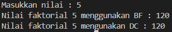
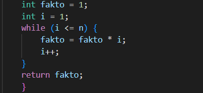

|  | Algorithm and Data Structure |
|--|--|
| NIM | 254107020165 |
| Nama |  Inas Asami El Murtadho |
| Kelas | TI - 1F |
| Repository | [link] (https://github.com/inasaeel-dev/PRAKTIKUM-ASD-2026/tree/main) |

## 5.2.2 Verfikasi Hasil Percobaan 1

## Pertanyaan Percobaan 1
1. Pada base line Algoritma Divide Conquer untuk melakukan pencarian nilai faktorial, jelaskan perbedaan bagian kode pada penggunaan if dan else!
- if digunakan untuk menentukan kondisi, sedangkan else untuk melakukan proses pembagian masalah dan memanggil fungsi kembali

2. Apakah memungkinkan perulangan pada method faktorialBF() diubah selain menggunakan for? Buktikan!
- memungkinkan, perulangan pada method faktorialBF tidak harus menggunakan for

3. Jelaskan perbedaan antara fakto *= i; dan int fakto = n * faktorialDC(n-1); !
- fakto *= i untuk menghitung faktorial dengan menggunakan perulangan, untuk operator *= berfungsi untuk mengalikan nilai variabel dengan nilai lain, sedangkan fakto = n *faktorialDC (n-1); menghitung faktorial dengan rekursi, nilai n dikalikan dengan hasil dari pemanggilan fungsi

4. Buat Kesimpulan tentang perbedaan cara kerja method faktorialBF() dan faktorialDC()!
- method faktorialBF () menghitung faktorial dengan perkalian berulang menggunakan perulangan dari 1 sampai n. sedangkan faktorialDC() menghitung faktorial dengan memanggil fungsi rekursif dari n hingga mencapai kondisi dasar, lalu hasilnya dikalikan kembali ke nilai awal

## 5.2.2 Verfikasi Hasil Percobaan 2