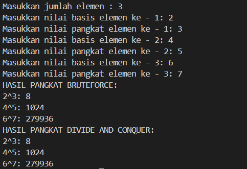
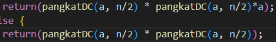
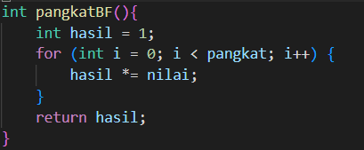
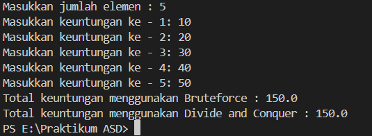
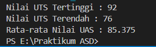

|  | Algorithm and Data Structure |
|--|--|
| NIM | 254107020165 |
| Nama |  Inas Asami El Murtadho |
| Kelas | TI - 1F |
| Repository | [link] (https://github.com/inasaeel-dev/PRAKTIKUM-ASD-2026/tree/main) |

## 5.2.2 Verfikasi Hasil Percobaan 1

## Pertanyaan Percobaan 1
1. Pada base line Algoritma Divide Conquer untuk melakukan pencarian nilai faktorial, jelaskan perbedaan bagian kode pada penggunaan if dan else!
- if digunakan untuk menentukan kondisi, sedangkan else untuk melakukan proses pembagian masalah dan memanggil fungsi kembali

2. Apakah memungkinkan perulangan pada method faktorialBF() diubah selain menggunakan for? Buktikan!
- memungkinkan, perulangan pada method faktorialBF tidak harus menggunakan for

3. Jelaskan perbedaan antara fakto *= i; dan int fakto = n * faktorialDC(n-1); !
- fakto *= i untuk menghitung faktorial dengan menggunakan perulangan, untuk operator *= berfungsi untuk mengalikan nilai variabel dengan nilai lain, sedangkan fakto = n *faktorialDC (n-1); menghitung faktorial dengan rekursi, nilai n dikalikan dengan hasil dari pemanggilan fungsi

4. Buat Kesimpulan tentang perbedaan cara kerja method faktorialBF() dan faktorialDC()!
- method faktorialBF () menghitung faktorial dengan perkalian berulang menggunakan perulangan dari 1 sampai n. sedangkan faktorialDC() menghitung faktorial dengan memanggil fungsi rekursif dari n hingga mencapai kondisi dasar, lalu hasilnya dikalikan kembali ke nilai awal

## 5.3.3 Verifikasi Hasil Percobaan 2

## 5.3.3 Pertanyaan Percobaan 2
1. Jelaskan mengenai perbedaan 2 method yang dibuat yaitu pangkatBF() dan pangkatDC()!
- pangkatBF() untuk menghitung pangkat dengan cara perkalian berulang menggunakan loop
- pangkatDC() untuk menghitung perpangkatan dengan cara membagi masalah menjadi lebih kecil menggunakan nilai rekursif

2. Apakah tahap combine sudah termasuk dalam kode tersebut?Tunjukkan!

3. Pada method pangkatBF()terdapat parameter untuk melewatkan nilai yang akan dipangkatkan
dan pangkat berapa, padahal di sisi lain di class Pangkat telah ada atribut nilai dan pangkat, apakah menurut Anda method tersebut tetap relevan untuk memiliki parameter? Apakah bisa jika method tersebut dibuat dengan tanpa parameter? Jika bisa, seperti apa method pangkatBF() yang tanpa parameter?
- bisa dipakai untuk nilai apapun tanpa bergantung pada atribut class, contohnya: 

4. Tarik kesimpulan tentang cara kerja method pangkatBF() dan pangkatDC()!
- method pangkatBF() bekerja dengan cara mengalikan nilai secara berulang ulang menggunakan perulangan hingga nilai mencapai pada jumlah pangkat yang diinginkan. Method pangkatDC() bekerja dengan cara membagi masalah menjadi bagian yang lebih kecil (pangkat dibagi menjadi dua bagian) kemudan hasil dari setiap pangkat akan digabungkan kembali melalui proses combine

## 5.4.4 Verifikasi Hasil Percobaan 3

## 5.4.4 Pertanyaan Percobaan 3
1. Kenapa dibutuhkan variable mid pada method TotalDC()?
- mid digunakan untuk menentukan titik tengah dari array dan mid akan membagi menjadi dua bagian array dalam metode divide and conquer sehingga pada bagian kiri memiliki indeks dari l sampai mid

2. Untuk apakah statement di bawah ini dilakukan dalam TotalDC()?
- untuk menghitung jumlah nilai pada nilai masing-masing bagian array. lsum digunakan untuk menghitung jml elemen di bagian kiri dan rsum untuk menghitung jml elemen bagian kiri

3. Kenapa diperlukan penjumlahan hasil lsum dan rsum seperti di bawah ini?
- setelah dilakukan perhitungan tiap gabungan lalu akan dilakukan combine untuk mendapatkan nilai total keseluruhan

4. Apakah base case dari totalDC()?
- ketika l == r, pada kondisi ini array hanya memiliki satu elemen sehingga tidak perlu di bagi lagi

5. Tarik Kesimpulan tentang cara kerja totalDC()
- method totalDC() untuk membagi masalah menjadi bagian yang lebih kecil lalu menyelesaikan masing-masing bagian dan hasilnya untuk mendapatkan nilai total keseluruhan. Array dibagi menjadi dua menggunakan mid lalu dihitung lsum dan rsum kemudian dilakukannya lsum + rsum

## Tugas Praktikum
